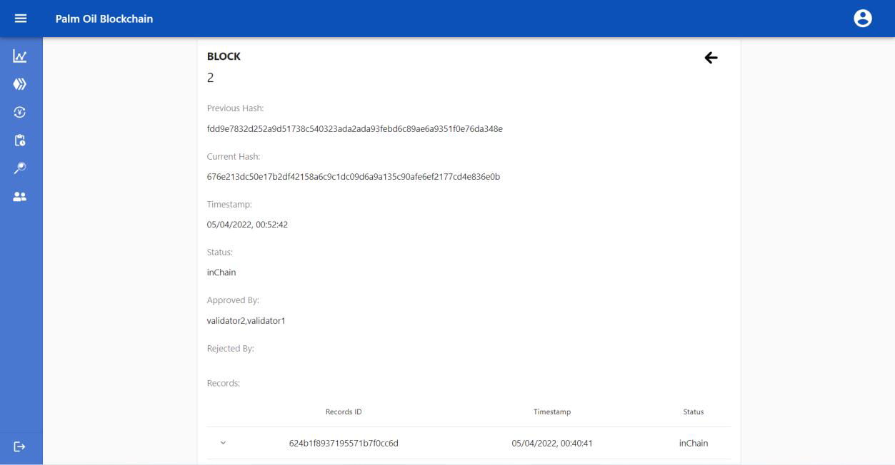
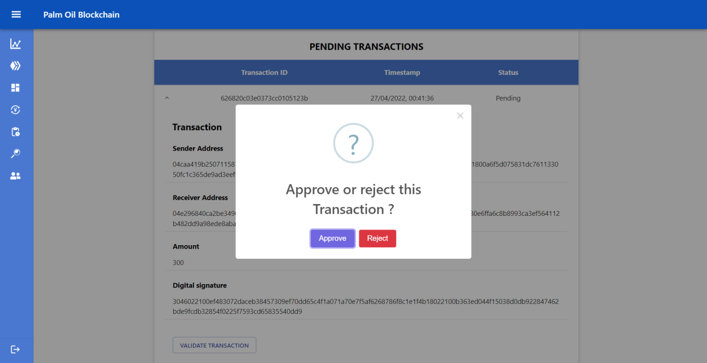

# Blockchain for Palm Oil Supply Chain

- The palm oil industry faces significant challenges of reliably tracking and managing its supply chain.

- Not to mention the emerging environmental concerns as green and sustainable practices are becoming prominent in supply chain management to reduce waste and ultimately, to achieve Circular Economy.

- Legacy supply chain model lacks transparency, real-time data monitoring, and faces privacy and security concerns.

- To address these challenges, this project adopts the blockchain technology and constructs a proof-of-concept blockchain system for the palm oil supply chain.

## Features

- Cross Platform (Electron.js) Desktop App
- Private Blockchain
- Creating transactions and supply chain records
- Validators involved only in the Consensus Mechanism to validate transactions and records
- Product Traceability to trace each of the product transformation stages from warehouse all the way back to plantation stage.
- Data visualization for the overall supply chain activities and blockchain statuses

## Tech Stack

**Client:** React, Electron, JavaScript, HTML, CSS

**Server:** Node, Express, MongoDB

## Screenshots
### Login Page

### Dashboard Page
- Various graphs and charts are used to display the overall statistics of the blockchain. These statistics include:
    - the number of weekly created blocks
    - the number of weekly created transactions and records
    - weekly created products
    - the ratio of approved blocks to rejected blocks
    - the number of users from each supply chain role who are part of this blockchain.

### Creating transactions or Supply Chain Records

- Sender's public and private key is required as well as the receiver address.

- In this blockchain application, we assume that supply chain records can only be created after the buyer has paid the supplier, after which a transaction receipt ID will be obtained as a proof that transactions have taken place. Hence the need of entering transaction receipt id in the form.
- The following 2 different forms showcase the products available to choose in the form for different supply chain actors which are planters and millers respectively.

### User Profiles
- To ease the process of senders obtaining the public keys of the receivers, usernames, supply chain roles and public keys of all users involved in this palm oil blockchain will be listed on this page.

- Each user can view their own transaction and supply chain records

### Blockchain table displaying each blocks in chronological order

- Each individual block contains block ID, timestamp and status of each records in the block

### Validators & Consensus Mechanism
- Only 'Validators' role is allowed to be involved in the consensus mechanism to validate the records
- Consensus will be achieved when the majority (at least 66%) of the validators have approved the records which allows approving certain records and/or appending the block to the chain

### Product Traceability

- To trace the sources of products in the palm oil supply chain, users can enter the ID of the product.

- Examples of product traceability feature

